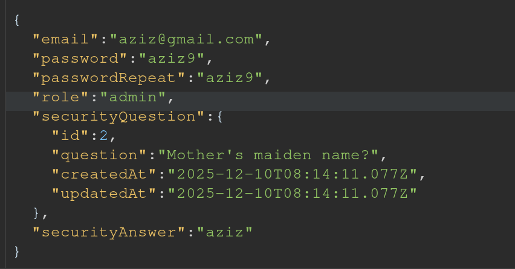

# **Rapport de vulnérabilité — Admin Registration (Broken Access Control)**

## **1. Méthodologie**

1. Accès au formulaire d'inscription utilisateur.
2. **Interception de la requête POST** vers l'endpoint **`/api/Users/`** lors de la création d'un compte.
3. Analyse du body JSON de base contenant les champs standards :
   * `email`
   * `password`
   * `passwordRepeat`
   * `securityQuestion`
   * `securityAnswer`
4. **Ajout d'un champ non prévu** dans le body : **`"role":"admin"`**.
5. Modification du body de la requête :
   ```json
   {
     "email":"aziz@gmail.com",
     "password":"aziz9",
     "passwordRepeat":"aziz9",
     "securityQuestion":{
       "id":2,
       "question":"Mother's maiden name?",
       "createdAt":"2025-12-10T08:14:11.077Z",
       "updatedAt":"2025-12-10T08:14:11.077Z"
     },
     "securityAnswer":"aziz",
     "role":"admin"
   }
   ```
6. Envoi de la requête modifiée → compte créé avec **privilèges administrateur** → challenge validé.



### **Techniques utilisées**

* Interception et manipulation de requêtes HTTP
* Parameter Pollution
* Escalade de privilèges lors de l'inscription

### **Outils utilisés**

* Navigateur web (DevTools / Network)

---

## **2. Vulnérabilité**

* **Type :** Broken Access Control — Privilege Escalation
* **Composant affecté :** Endpoint `POST /api/Users/` / Système d'inscription
* **Sévérité :** **Critique** (création de comptes administrateurs non autorisée)

---

## **3. Risques**

* Création de comptes administrateurs par n'importe quel utilisateur
* Escalade de privilèges complète dès l'inscription
* Compromission totale de l'application (accès admin illimité)
* Possibilité de suppression, modification ou vol de données sensibles
* Atteinte grave à l'intégrité et à la sécurité du système

---

## **4. Actions**

* **Valider côté serveur** les champs autorisés lors de l'inscription (whitelist stricte)
* Ne **jamais** accepter le champ `role` dans les requêtes d'inscription utilisateur
* Implémenter une **validation stricte des propriétés** acceptées dans le body JSON
* Forcer le rôle par défaut (`user`) côté serveur, indépendamment des données envoyées
* Séparer complètement les endpoints de création d'utilisateurs standards et administrateurs