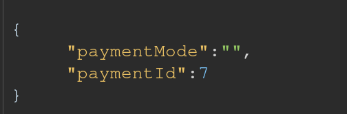
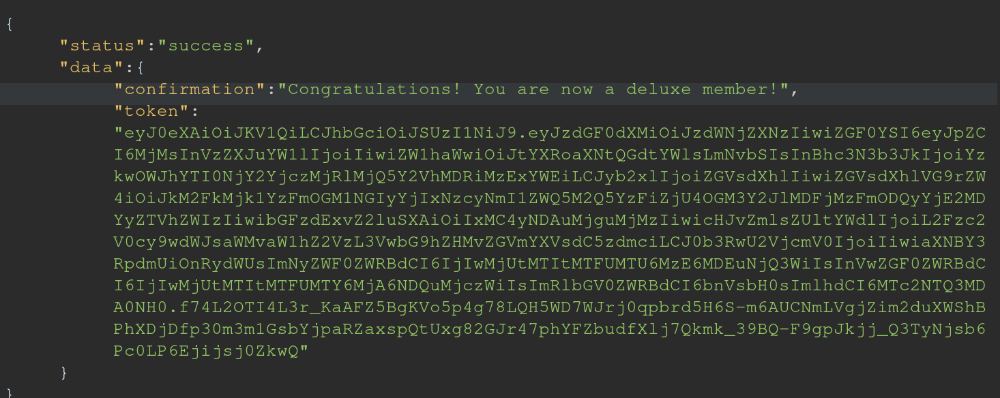

# **Rapport de vulnérabilité — Deluxe Fraud (Broken Access Control)**

## **1. Méthodologie**

1. Accès à la page pour souscrire au **Deluxe Membership**.
2. Ajout d'une **fausse carte bancaire** pour initier le processus de paiement.
3. Observation du bouton de validation **désactivé** (attribut HTML `disabled`).
4. Inspection du code source HTML et suppression de tous les attributs **`disabled`** du bouton.
5. Le bouton devient cliquable → clic et **interception de la requête** de paiement.
6. Réponse du serveur : **"Insufficient balance"** (solde insuffisant).
7. Modification du body de la requête interceptée :
   * Changement de `"paymentMode":"wallet"` vers **`"paymentMode":""`** (valeur null/vide)
   * Conservation de `"paymentId":7`
8. Renvoi de la requête modifiée → **paiement accepté sans vérification** → obtention du Deluxe Membership → challenge validé.

### **Techniques utilisées**

* Manipulation du DOM HTML (suppression d'attributs `disabled`)
* Interception et modification de requêtes HTTP
* Bypass de validation de paiement côté serveur

### **Outils utilisés**

* Navigateur web (DevTools / Inspector / Network)

---

## **2. Vulnérabilité**

* **Type :** Broken Access Control — Payment Bypass / Insufficient Business Logic Validation
* **Composant affecté :** Système de paiement / Endpoint de souscription Deluxe Membership
* **Sévérité :** **Critique** (bypass complet du paiement)

---

## **3. Risques**

* Obtention gratuite de services premium payants
* Perte de revenus pour l'entreprise
* Exploitation massive si la technique est divulguée
* Fraude généralisée sur les abonnements premium
* Contournement total du système de paiement
* Atteinte grave à l'intégrité du système commercial

---

## **4. Actions**

* Implémenter une **validation stricte côté serveur** pour tous les modes de paiement
* Ne **jamais** accepter un `paymentMode` vide ou null
* Vérifier le solde et la validité du paiement **avant** d'accorder l'accès au service
* Rejeter toute requête avec des paramètres de paiement invalides ou manquants
* Ajouter des logs d'audit pour détecter les tentatives de fraude
* Ne pas se fier aux contrôles côté client (attributs `disabled`, JavaScript)