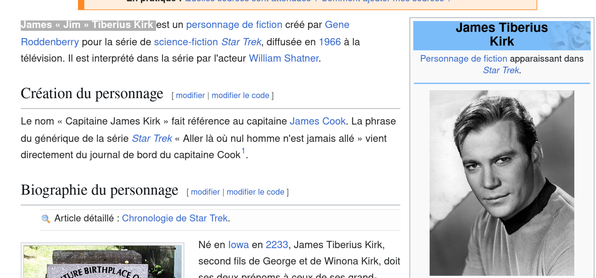

# **Rapport de vulnérabilité — Reset Jim's Password (Broken Authentication)**

## **1. Méthodologie**

1. Consultation des **avis clients** laissés par Jim sur différents produits.
2. Observation d'une récurrence : tous ses commentaires font référence à **Star Trek**.
3. Recherche **OSINT** sur Google avec les mots-clés **"Jim Star Trek"**.
4. Découverte du personnage **James "Jim" Tiberius Kirk** sur **Wikipedia**, protagoniste de Star Trek.
5. Identification d'informations personnelles : le nom de son frère est **Samuel** (Samuel Kirk).
6. Utilisation de la fonctionnalité **"Forgot Password"** pour le compte de Jim.
7. Soumission de la réponse à la question de sécurité (nom du frère) : **"Samuel"** → réinitialisation du mot de passe réussie → challenge validé.

### **Techniques utilisées**

* OSINT (Open Source Intelligence)
* Analyse de comportement utilisateur (avis produits)
* Exploitation de question de sécurité faible basée sur la culture populaire
* Recherche d'informations publiques (Wikipedia)

### **Outils utilisés**

* Navigateur web
* Google
* Wikipedia

---

## **2. Vulnérabilité**

* **Type :** Broken Authentication — Weak Security Question
* **Composant affecté :** Mécanisme "Forgot Password" / Question de sécurité
* **Sévérité :** **Critique**

---

## **3. Risques**

* Compromission complète du compte de Jim
* Accès non autorisé aux données personnelles et historique d'achat
* Possibilité d'exploitation similaire sur d'autres comptes avec réponses prédictibles
* Exploitation massive via analyse des comportements publics des utilisateurs

---

## **4. Actions**

* Supprimer les **questions secrètes prédictibles** ou basées sur des références culturelles
* Éviter les questions dont les réponses peuvent être déduites via OSINT ou comportements publics
* Utiliser un système de récupération par **token sécurisé envoyé par email**
* Implémenter l'**authentification multi-facteurs (MFA/2FA)**
* Sensibiliser les utilisateurs sur les risques de laisser des indices personnels dans leurs interactions publiques