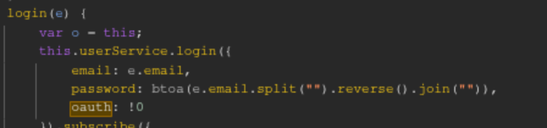
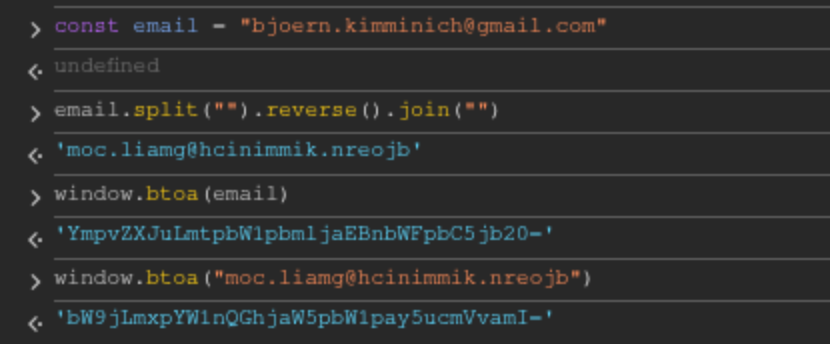

# **Rapport de vulnérabilité — Login Bjoern (Broken Authentication)**

## **1. Méthodologie**

1. Analyse du code source à la recherche de la partie **OAuth** (connexion via Gmail mentionnée dans le challenge).
2. Découverte de la fonction de login OAuth et inspection de la logique de génération du mot de passe.
3. Identification de l'algorithme faible :
   * L'email est **inversé** (chaîne de caractères retournée)
   * Puis **encodé en Base64**
4. Application de la logique sur l'email de Bjoern :
   * Récupération de l'email de Bjoern : **`bjoern.kimminich@gmail.com`**
   * Inversion de la chaîne : **`moc.liamg@hcinimmik.nreojb`**
   * Encodage en Base64 dans la console navigateur
5. Utilisation du résultat comme mot de passe → connexion réussie au compte de Bjoern → challenge validé.

### **Techniques utilisées**

* Analyse de code source (OAuth implementation)
* Reverse engineering de l'algorithme de génération de mot de passe
* Exploitation d'un algorithme de hashing faible (réversible)

### **Outils utilisés**

* Navigateur web (DevTools / Console)
* Fonction JavaScript `btoa()` pour encodage Base64

---

## **2. Vulnérabilité**

* **Type :** Broken Authentication — Weak Password Generation Algorithm
* **Composant affecté :** Système OAuth / Génération automatique de mots de passe
* **Sévérité :** **Critique**

---

## **3. Risques**

* Compromission de n'importe quel compte OAuth connaissant uniquement l'email
* Algorithme de génération de mot de passe prévisible et réversible
* Exposition massive de tous les comptes utilisant l'authentification OAuth

---

## **4. Actions**

* Utiliser un **générateur de mot de passe cryptographiquement sécurisé**
* Ne **jamais** dériver un mot de passe directement de l'email utilisateur
* Stocker les mots de passe avec un **algorithme de hashing robuste** (bcrypt)
* Ajouter du **sel (salt)** unique par utilisateur lors du hashing
* Éviter toute logique prédictible ou réversible dans la génération de credentials
