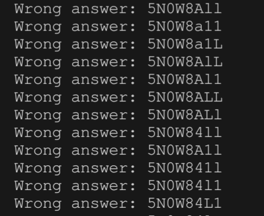

# **Rapport de vulnérabilité — Reset Morty's Password (Broken Authentication)**

## **1. Méthodologie**

1. **Identification de l'utilisateur cible** : recherche sur "Morty" menant à **Morty Smith** (personnage de Rick and Morty).
2. **Recherche OSINT** sur le wiki Rick and Morty : **http://rickandmorty.wikia.com/wiki/Morty**
3. Consultation de la section **"Family"** révélant que Morty avait un chien nommé **Snuffles** (alias **Snowball**).
4. Accès à la fonctionnalité **"Forgot Password"** : **`/forgot-password`**
5. Soumission de l'email : **`morty@juice-sh.op`**
6. **Création d'une wordlist** avec toutes les mutations possibles de "snuffles" et "snowball" :
   * Variations en minuscules (a-z)
   * Variations en majuscules (A-Z)
   * Variations avec chiffres (0-9)
   * Variations en **leet-speak** (ex: `5N0wb41L`, `5nuffl35`, etc.)
7. **Utilisation d'un script de brute force** pour itérer sur la wordlist et envoyer des requêtes au serveur
9. **Exécution du script** : découverte de la réponse correcte à la question de sécurité : **`5N0wb41L`** → challenge validé.

### **Techniques utilisées**

* OSINT (Rick and Morty Wiki)
* Génération de wordlist avec mutations et leet-speak
* Brute force automatisé sur question de sécurité

### **Outils utilisés**

* Navigateur web
* Rick and Morty Wiki
* Script Python : **juice-shop-mortys-question-brute-force.py** (par philly-vanilly sur GitHub)

---

## **2. Vulnérabilité**

* **Type :** Broken Authentication — Weak Security Question + Rate Limiting Bypass
* **Composant affecté :** Mécanisme "Forgot Password" / Endpoint `/rest/user/reset-password` / Rate limiting
* **Sévérité :** **Critique**

---

## **3. Risques**

* Compromission complète du compte via brute force sur question de sécurité
* Bypass du rate limiting permettant des attaques automatisées massives
* Exploitation du header `X-Forwarded-For` pour contourner les protections anti-brute force
* Possibilité d'automatisation sur tous les comptes avec questions prédictibles
* Question de sécurité basée sur des informations publiques (OSINT)

---

## **4. Actions**

* Supprimer les **questions secrètes prédictibles** ou basées sur des informations publiques (OSINT)
* Implémenter un **rate limiting robuste** non contournable via headers HTTP
* **Ne jamais faire confiance au header `X-Forwarded-For`** pour identifier l'origine des requêtes
* Utiliser l'IP réelle du client pour le rate limiting
* Implémenter un **CAPTCHA** après plusieurs tentatives échouées
* Utiliser un système de récupération par **token sécurisé envoyé par email**
* Implémenter l'**authentification multi-facteurs (MFA/2FA)**
* Bloquer temporairement les comptes après un nombre défini d'échecs
* Logger et alerter sur les tentatives de brute force