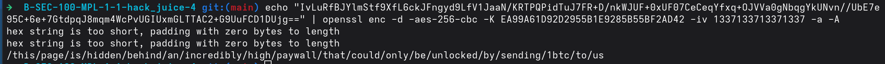

# **Rapport de vulnérabilité — Premium Paywall (Cryptographic Issues)**

## **1. Méthodologie**

1. **Inspection du code source HTML** de la ligne correspondante dans le Score Board à coté d'un symbole animé.
2. Découverte d'un **commentaire HTML chiffré** : 
   ```html
   <!--IvLuRfBJYlmStf9XfL6ckJFngyd9LfV1JaaN/KRTPQPidTuJ7FR+D/nkWJUF+0xUF07CeCeqYfxq+OJVVa0gNbqgYkUNvn//UbE7e95C+6e+7GtdpqJ8mqm4WcPvUGIUxmGLTTAC2+G9UuFCD1DUjg==-->
   ```
3. Identification du chiffrement utilisé : **AES-256 en mode CBC**.
4. Accès au fichier de clé : **`http://localhost:3000/encryptionkeys/premium.key`**
   * Récupération de la **clé AES** : `EA99A61D92D2955B1E9285B55BF2AD42`
   * Récupération de l'**IV (Initialization Vector)** : `1337133713371337`
5. **Déchiffrement du cipher text** avec OpenSSL :
   ```bash
   echo "IvLuRfBJYlmStf9XfL6ckJFngyd9LfV1JaaN/KRTPQPidTuJ7FR+D/nkWJUF+0xUF07CeCeqYfxq+OJVVa0gNbqgYkUNvn//UbE7e95C+6e+7GtdpqJ8mqm4WcPvUGIUxmGLTTAC2+G9UuFCD1DUjg==" | openssl enc -d -aes-256-cbc -K EA99A61D92D2955B1E9285B55BF2AD42 -iv 1337133713371337 -a -A
   ```
6. **Texte en clair obtenu** :
   ```
   /this/page/is/hidden/behind/an/incredibly/high/paywall/that/could/only/be/unlocked/by/sending/1btc/to/us
   ```
7. Accès à l'URL déchiffrée : **`http://localhost:3000/this/page/is/hidden/behind/an/incredibly/high/paywall/that/could/only/be/unlocked/by/sending/1btc/to/us`** → challenge validé.



### **Techniques utilisées**

* Inspection de code source HTML (commentaires chiffrés)
* Récupération de clés de chiffrement exposées
* Déchiffrement AES-256-CBC avec OpenSSL

### **Outils utilisés**

* Navigateur web (DevTools / Inspector)
* OpenSSL (déchiffrement)

---

## **2. Vulnérabilité**

* **Type :** Cryptographic Issues — Exposed Encryption Keys
* **Composant affecté :** Répertoire `/encryptionkeys/` / Fichier `premium.key` / Commentaires HTML chiffrés
* **Sévérité :** **Critique** (clés de chiffrement exposées publiquement)

---

## **3. Risques**

* Exposition publique de clés de chiffrement AES sensibles
* Déchiffrement de toutes les données protégées par ces clés
* Bypass complet du paywall premium
* Accès non autorisé à du contenu payant
* IV faible (`1337`) facilement prévisible

---

## **4. Actions**

* **Ne jamais exposer les clés de chiffrement** dans des répertoires accessibles publiquement
* Bloquer l'accès au répertoire `/encryptionkeys/`
* Stocker les clés de chiffrement dans des **variables d'environnement sécurisées** ou des **secrets managers**
* Utiliser des **IV aléatoires et uniques** pour chaque chiffrement (pas `1337`)
* Implémenter un système d'authentification et d'autorisation robuste pour les contenus premium
* Ne jamais inclure de données sensibles chiffrées dans les commentaires HTML côté client
