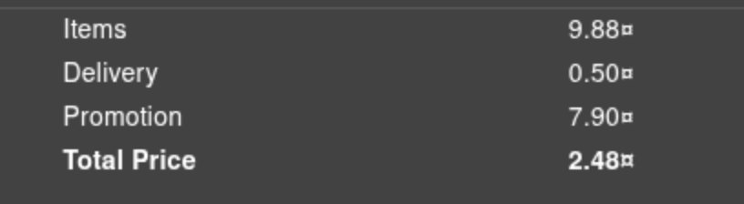

# **Rapport de vulnérabilité — Forged Coupon (Cryptographic Issues)**

## **1. Méthodologie**

1. Accès à l'endpoint **`/ftp`** pour explorer les fichiers disponibles.
2. Téléchargement du fichier **`coupons_2013.md.bak`** en utilisant le bypass **Null Byte** (`%2500.md`) pour contourner la restriction d'extension.
3. Téléchargement du fichier **`package.json.lock`** avec la même technique pour identifier les dépendances du projet.
4. Découverte d'un module **`z85`** utilisé dans le projet (trouvé en bas du fichier `package.json.lock`).
5. Analyse des coupons existants dans `coupons_2013.md.bak` pour comprendre leur structure.
6. Recherche Google **"decode z85"** et utilisation de l'outil **https://cryptii.com/** pour décoder les coupons.
7. Identification du format des coupons : **`MOISANNEE-POURCENTAGE`** (ex: `DEC25-80` pour 80% de réduction en décembre 2025).
8. Création d'un coupon personnalisé avec le format souhaité (ex: `DEC25-80`).
9. **Encodage en Z85** du nouveau coupon via https://cryptii.com/.
10. Application du coupon forgé lors d'une commande → **80% de réduction appliquée** → challenge validé.

### **Techniques utilisées**

* Null Byte Injection pour bypass de restrictions de fichiers
* Analyse de fichiers de backup et de dépendances
* Reverse engineering du format de coupons
* Décodage/encodage Z85
* Forgery de coupons de réduction

### **Outils utilisés**

* Navigateur web
* https://cryptii.com/ (décodage/encodage Z85)

---

## **2. Vulnérabilité**

* **Type :** Cryptographic Issues — Predictable Coupon Generation
* **Composant affecté :** Système de coupons
* **Sévérité :** **Élevée** (génération de coupons avec réductions personnalisées)

---

## **3. Risques**

* Création de coupons frauduleux avec des réductions (jusqu'à 100%)
* Perte financière importante pour l'entreprise
* Exploitation massive si la technique est découverte par des utilisateurs malveillants
* Impossibilité de distinguer les coupons légitimes des coupons forgés
* Atteinte à l'intégrité du système de promotion

---

## **4. Actions**

* Ne **jamais** utiliser un encodage réversible (comme Z85, Base64) pour sécuriser des coupons
* Implémenter un système de **signature cryptographique** pour valider l'authenticité des coupons
* Stocker les coupons valides dans une **base de données sécurisée** côté serveur avec vérification stricte
* Ajouter des **identifiants uniques** (UUID) pour chaque coupon généré
* Limiter l'utilisation des coupons (nombre d'utilisations, date d'expiration stricte)
* Ne pas exposer les fichiers de backup ou package.json.lock via `/ftp`
* Corriger la vulnérabilité Null Byte sur l'endpoint
