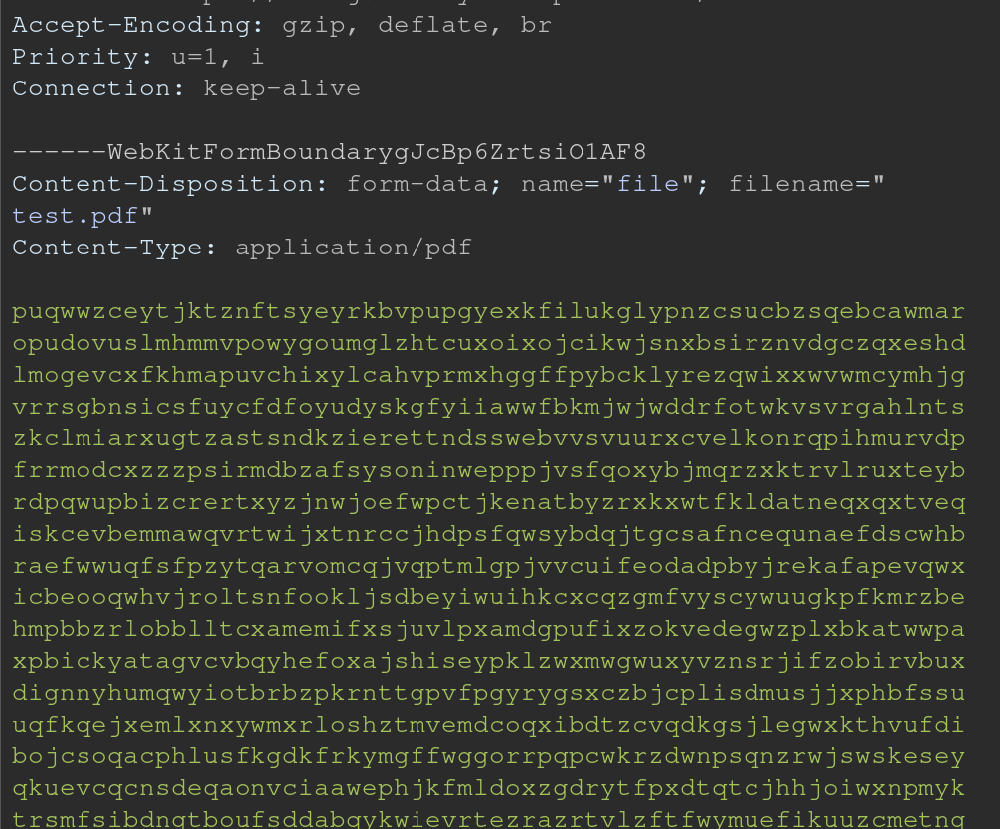

# **Rapport de vulnérabilité — Upload Size (Improper Input Validation)**

## **1. Méthodologie**

1. Accès à la page de **Complaint** (formulaire permettant l'upload de fichiers).
2. Upload initial d'un **fichier PDF de moins de 100 KB** pour passer la validation côté client.
3. **Interception de la requête POST** vers l'endpoint **`/file-upload`**.
4. **Modification du payload** intercepté :
   * Remplacement du contenu du PDF par le **contenu d'un fichier texte de plus de 100 KB**
   * Conservation de la structure de la requête multipart/form-data
5. Envoi de la requête modifiée → **upload accepté malgré la taille dépassant 100 KB** → challenge validé.

### **Techniques utilisées**

* Interception et manipulation de requêtes HTTP
* Bypass de validation côté client
* Modification de payload multipart/form-data
* Exploitation de l'absence de validation côté serveur

### **Outils utilisés**

* Navigateur web (DevTools / Network)

---

## **2. Vulnérabilité**

* **Type :** Improper Input Validation — File Size Validation Bypass
* **Composant affecté :** Endpoint `POST /file-upload` / Validation de taille de fichier
* **Sévérité :** **Élevée** (contournement des limites de taille d'upload)

---

## **3. Risques**

* Upload de fichiers volumineux pouvant saturer l'espace disque du serveur
* Déni de service (DoS) via upload massif de fichiers surdimensionnés
* Consommation excessive de bande passante
* Surcharge du serveur et dégradation des performances
* Possibilité d'upload de fichiers malveillants de grande taille

---

## **4. Actions**

* Implémenter une **validation stricte de la taille des fichiers côté serveur**
* Ne **jamais** se fier uniquement aux validations côté client
* Définir une limite maximale de taille au niveau de l'application et du serveur web
* Vérifier la taille réelle du fichier uploadé avant traitement
* Ajouter des logs pour détecter les tentatives d'upload anormales
