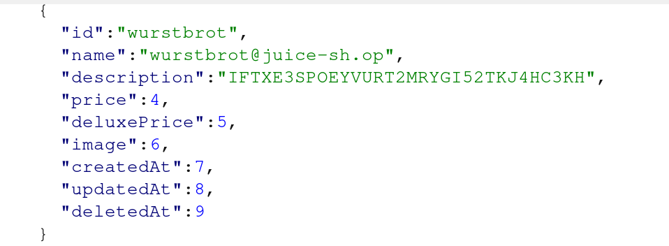

# **Rapport de vulnérabilité — Two Factor Authentication (Injection)**

## **1. Méthodologie**

1. **Découverte de l'endpoint vulnérable** : identification de **`GET /rest/products/search?q=...`** vulnérable à l'injection SQL.
2. **Énumération de la base de données** : exploitation de l'injection SQL pour :
   * Lister toutes les tables de la base
   * Lister toutes les colonnes
   * Comprendre la structure complète de la base de données
   * Identification de la table critique : **`Users`**
3. **Extraction des données utilisateurs** : via l'injection SQL, extraction des champs :
   * `username`
   * `email`
   * `description`
4. **Découverte d'un secret 2FA** : repérage de l'utilisateur **`wurstbrot`** dont la colonne `description` contient un **secret TOTP (2FA) stocké en clair**.
5. **Compromission de la double authentification** : ajout du secret TOTP récupéré dans une application d'authentification (Google Authenticator, Authy, etc.) pour générer des codes 2FA valides.
6. **Connexion au compte** : connexion avec l'email **`wurstbrot@juice-sh.op`** et saisie du code 2FA valide généré.
7. **Validation du challenge** : connexion réussie → challenge "Two Factor Authentication" automatiquement validé.

### **Techniques utilisées**

* Injection SQL (enumeration complète de la base)
* Extraction de données sensibles (secret TOTP)
* Compromission de l'authentification multi-facteurs (2FA)
* Génération de codes TOTP valides

### **Outils utilisés**

* Navigateur web (endpoint `/rest/products/search`)
* Application d'authentification 2FA (Google Authenticator, Authy, etc.)

---

## **2. Vulnérabilité**

* **Type :** Injection SQL + Sensitive Data Exposure (2FA Secret)
* **Composant affecté :** Endpoint `/rest/products/search?q=` / Table `Users` / Stockage de secrets 2FA
* **Sévérité :** **Critique** (bypass complet du 2FA + compromission totale du compte)

---

## **3. Risques**

* Énumération complète de la base de données via injection SQL
* Exposition de secrets 2FA stockés en clair dans la base
* Bypass total de l'authentification multi-facteurs
* Compromission massive de comptes utilisateurs protégés par 2FA
* Perte totale de confiance dans le système de sécurité

---

## **4. Actions**

* Utiliser des **requêtes préparées (prepared statements)** pour prévenir l'injection SQL
* **Ne jamais stocker les secrets 2FA en clair** dans la base de données
* Chiffrer les secrets TOTP avec un algorithme robuste (AES-256) et une clé de chiffrement sécurisée
* Valider et échapper toutes les entrées utilisateur avant exécution SQL