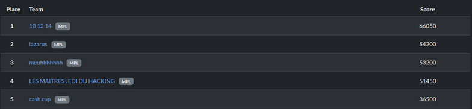
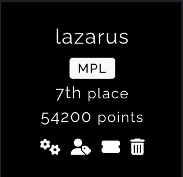

# OWASP Juice Shop — Write-Ups CTF

> **Projet scolaire de cybersécurité — Epitech Montpellier**
> Réalisé en binôme avec **Mathis Monnin** • **7ème au classement national** • **2ème sur le campus de Montpellier**

---

## Présentation du projet

Ce dépôt regroupe l'ensemble des **write-ups** (rapports de vulnérabilités) rédigés dans le cadre d'un projet CTF (**Capture The Flag**) imposé par **Epitech** en tant que projet.

L'objectif était d'exploiter l'application volontairement vulnérable **OWASP Juice Shop**, une application web de e-commerce fictive conçue par l'[OWASP (Open Web Application Security Project)](https://owasp.org/) pour former les professionnels de la sécurité. Chaque challenge représente une vulnérabilité réelle classifiée selon les standards **OWASP Top 10**.


---

## Classement

### 2ème du campus de Montpellier



### 7ème au classement national



---

## Structure des write-ups

Chaque fichier de ce dépôt suit la convention de nommage suivante :

```
<Catégorie>-<Difficulté>-<Nom du challenge>.md
```

La **difficulté** est représentée par un chiffre allant de `1` à `6` (nombre d'étoiles dans Juice Shop). Nous devions documenter uniquement les challenges avec une difficulté supérieure ou égale à 3.

Chaque write-up est structuré de la même manière :
1. **Méthodologie** — Étapes de découverte et d'exploitation
2. **Vulnérabilité** — Type, composant affecté, sévérité
3. **Risques** — Impact potentiel en condition réelle
4. **Actions correctives** — Comment remédier à la faille

---

## Compétences mobilisées

- **OSINT** — Recherche d'informations en sources ouvertes pour identifier les cibles
- **SQL Injection** — Bypass d'authentification, extraction du schéma BDD, récupération de credentials
- **NoSQL Injection** — Manipulation de requêtes MongoDB, déni de service applicatif
- **XSS** — Injections côté client et serveur, contournement de CSP
- **Broken Authentication** — Brute force, analyse de tokens JWT, exploitation de questions secrètes
- **Cryptographie** — Décodage Base64, déchiffrement ROT13/AES, forge de coupons
- **Stéganographie** — Extraction de données cachées dans des fichiers images
- **Analyse de composants** — Identification de bibliothèques vulnérables, typosquatting npm
- **Supply Chain** — Attaque sur la chaîne d'approvisionnement logicielle
- **Burp Suite / DevTools** — Interception et manipulation des requêtes HTTP
- **Scripting Python** — Automatisation du brute force et de la génération de wordlists

---

## À propos d'OWASP Juice Shop

[OWASP Juice Shop](https://owasp.org/www-project-juice-shop/) est l'application web vulnérable la plus moderne et la plus complète jamais créée par l'OWASP. Elle contient des vulnérabilités couvrant l'intégralité de l'**OWASP Top 10** ainsi que de nombreuses autres failles de sécurité. Elle est utilisée dans des formations, des CTF et des cours de sécurité dans le monde entier.

---

## Auteurs

- **Kilian** — Étudiant Epitech Montpellier
- **Mathis** — Étudiant Epitech Montpellier

---

*Projet réalisé dans un cadre strictement éducatif et légal sur une application conçue à cet effet.*
