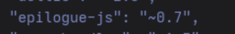
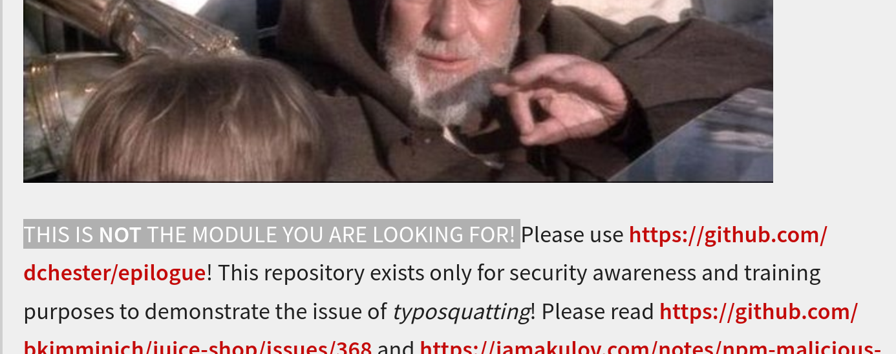

# **Rapport de vulnérabilité — Frontend Typosquatting (Vulnerable Components)**

## **1. Méthodologie**

1. Accès au fichier **`/3rdpartylicenses.txt`** contenant la liste des dépendances tierces et leurs licences.
2. Recherche (Ctrl+F) du mot-clé **"cookie"** dans le fichier.
3. Découverte d'une dépendance suspecte : **`ngy-cookie`**.
4. Identification du typosquatting : le vrai package est **`ngx-cookie`**, mais le projet utilise **`ngy-cookie`** (typosquatting malveillant).
5. Accès à la page **Complaint** (gestion des plaintes) pour identifier où cette dépendance est utilisée.
6. Validation du challenge en identifiant la dépendance typosquattée.

### **Techniques utilisées**

* Analyse de fichiers de licences tierces
* Identification de dépendances malveillantes (typosquatting)
* OSINT sur les packages npm

### **Outils utilisés**

* Navigateur web
* Fichier `/3rdpartylicenses.txt`

---

## **2. Vulnérabilité**

* **Type :** Vulnerable Components — Frontend Typosquatting
* **Composant affecté :** Dépendance `ngy-cookie` (typosquatting de `ngx-cookie`)
* **Sévérité :** **Critique** (package malveillant potentiellement compromis)

---

## **3. Risques**

* Inclusion de code malveillant dans l'application frontend
* Compromission potentielle de données utilisateurs (cookies, tokens)
* Atteinte à l'intégrité de l'application

---

## **4. Actions**

* Remplacer immédiatement **`ngy-cookie`** par le package légitime **`ngx-cookie`**
* Auditer le code source de `ngy-cookie` pour identifier tout comportement malveillant
* Vérifier l'intégrité de toutes les dépendances npm (npm audit, Snyk, etc.)
* Utiliser des lockfiles stricts (`package-lock.json`) et vérifier les checksums
* Implémenter une politique de revue systématique des nouvelles dépendances