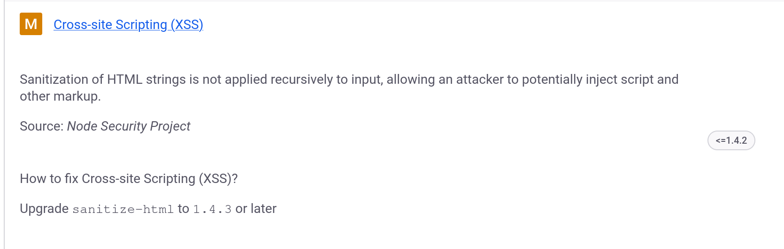

# **Rapport de vulnérabilité — Vulnerable Library (Vulnerable Components)**

## **1. Méthodologie**

1. Accès à l'endpoint **`/ftp`** pour récupérer les fichiers du projet.
2. Téléchargement du fichier **`package.json`** contenant toutes les dépendances.
3. Utilisation de l'outil d'analyse **https://snyk.io/advisor/npm-package/** pour auditer les packages.
4. Upload du fichier `package.json` sur la plateforme Snyk Advisor.
5. Analyse automatique des vulnérabilités connues pour chaque dépendance.
6. Identification d'une vulnérabilité critique : package **`sanitize-html`** en version **`1.4.2`** vulnérable à une **Cross-site Scripting (XSS)**.
7. Accès à la page **Complaint** (plaintes) de l'application.
8. Soumission du nom du package et sa version : **`sanitize-html 1.4.2`** → challenge validé.

### **Techniques utilisées**

* Audit automatisé de dépendances npm
* Recherche de vulnérabilités CVE connues
* Analyse de package.json avec Snyk Advisor

### **Outils utilisés**

* Endpoint `/ftp`
* https://snyk.io/advisor/npm-package/
* Navigateur web

---

## **2. Vulnérabilité**

* **Type :** Vulnerable Components — Outdated Library with XSS Vulnerability
* **Composant affecté :** Package `sanitize-html` version `1.4.2`
* **Sévérité :** **Élevée** (vulnérabilité XSS dans une bibliothèque de sanitization)

---

## **3. Risques**

* Bypass de la sanitization HTML permettant des attaques XSS
* Injection de scripts malveillants malgré l'utilisation d'une bibliothèque de sécurité
* Compromission de comptes utilisateurs via XSS
* Vol de cookies, tokens ou données sensibles

---

## **4. Actions**

* Mettre à jour immédiatement **`sanitize-html`** vers une version corrigée
* Auditer tous les usages de cette bibliothèque dans le code
* Vérifier si des XSS ont été exploités via cette vulnérabilité
* Utiliser des outils d'audit continu de dépendances :
  * `npm audit`
  * Snyk
* Mettre en place une politique de mise à jour régulière des dépendances
* Implémenter une Content Security Policy stricte pour limiter l'impact des XSS
* Ne pas exposer les fichiers `package.json` via des endpoints publics comme `/ftp`
