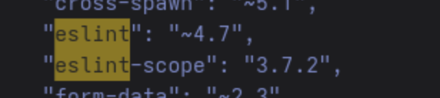

# **Rapport de vulnérabilité — Supply Chain Attack (Vulnerable Components)**

## **1. Méthodologie**

1. Accès à l'endpoint **`/ftp`** pour explorer les fichiers disponibles.
2. Téléchargement du **Developer Backup** de l'application.
3. Analyse du fichier **`package.json`** pour identifier les dépendances du projet.
4. Recherche de vulnérabilités connues sur les bases publiques :
   * **https://security.snyk.io**
5. Identification de la dépendance vulnérable : **`"eslint-scope": "3.7.2"`**.
6. Découverte d'un rapport officiel confirmant la compromission de cette version :
   * **https://github.com/eslint/eslint-scope/issues/39**
7. Validation du challenge en identifiant cette dépendance compromise.

### **Techniques utilisées**

* Analyse de fichiers de backup
* Audit de dépendances npm
* Recherche de vulnérabilités connues (CVE, advisories)
* Identification d'une supply chain attack documentée

### **Outils utilisés**

* Navigateur web
* https://security.snyk.io
* Endpoint `/ftp`

---

## **2. Vulnérabilité**

* **Type :** Vulnerable Components — Supply Chain Attack
* **Composant affecté :** Dépendance `eslint-scope` version `3.7.2`
* **Sévérité :** **Critique** (package npm compromis publiquement)

---

## **3. Risques**

* Exécution de code malveillant lors de l'installation ou l'exécution du package
* Vol de credentials, tokens ou variables d'environnement
* Compromission complète de l'environnement de développement
* Injection de backdoors dans l'application
* Propagation de la compromission à tous les utilisateurs du projet
* Atteinte grave à la chaîne d'approvisionnement logicielle (supply chain attack)

---

## **4. Actions**

* Mettre à jour immédiatement **`eslint-scope`** vers une version non compromise (≥ 3.7.3)
* Auditer l'ensemble du projet pour détecter tout code malveillant injecté
* Régénérer tous les secrets, tokens et credentials potentiellement exposés
* Utiliser des outils d'audit automatique de dépendances :
  * `npm audit`
  * Snyk
* Mettre en place une surveillance continue des dépendances
* Implémenter une politique stricte de mise à jour des dépendances
* Ne pas exposer les fichiers de backup (`package.json`) via des endpoints publics comme `/ftp`
