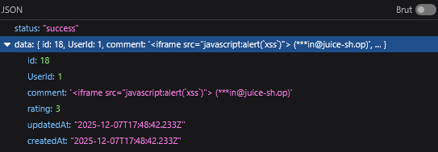
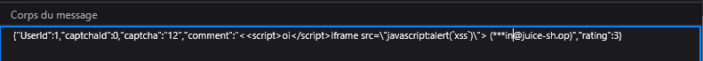

# **Rapport de vulnérabilité — Server-side XSS Protection (XSS)**

## **1. Méthodologie**

1. Test d'injection directe du payload : **`<iframe src="javascript:alert(`xss`)">`**.
2. Observation du comportement : le serveur supprime automatiquement cette chaîne via un **filtre côté backend**.
3. Contournement du filtre en cassant le pattern détecté avec le payload obfusqué : **`<iframe src=\"javascript:alert(`xss`)\">`**.
4. Envoi de la requête **POST** vers l'endpoint **`/api/Feedbacks/`** avec le payload modifié.
5. Une fois le feedback affiché, le navigateur reconstruit la balise `<iframe>` et exécute **`alert("xss")`** → validation du **Persisted XSS** avec bypass server-side.

### **Techniques utilisées**

* Injection XSS persistante (Stored XSS)
* Bypass de filtre server-side via obfuscation de balises
* Fragmentation de payload pour contourner la détection
* Exploitation de la reconstruction HTML par le navigateur

### **Outils utilisés**

* Navigateur web (DevTools / Network)

---

## **2. Vulnérabilité**

* **Type :** Server-side XSS Protection Bypass + Stored XSS
* **Composant affecté :** Endpoint `/api/Feedbacks/` / Système de filtrage côté serveur
* **Sévérité :** **Critique** (XSS persistant affectant tous les utilisateurs consultant le feedback)

---

## **3. Risques**

* Exécution de code malveillant persistant dans le navigateur de tous les utilisateurs
* Vol de sessions administrateurs ou utilisateurs privilégiés
* Compromission massive de comptes utilisateurs
* Propagation du payload à chaque consultation du feedback
* Atteinte grave à l'intégrité et à la sécurité de l'application

---

## **4. Actions**

* Implémenter un filtrage robuste côté serveur résistant aux techniques d'obfuscation
* Encoder systématiquement toutes les sorties HTML
* Ne pas se fier uniquement à des regex pour détecter les payloads malveillants
* Valider et filtrer les données avant stockage ET avant affichage